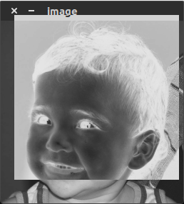
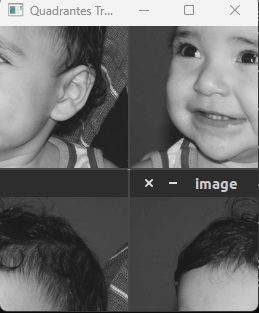
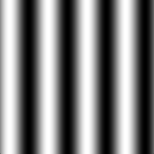
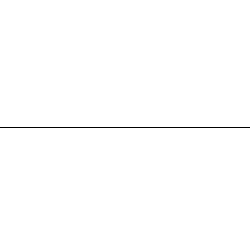
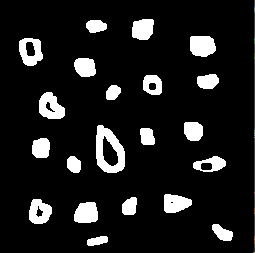
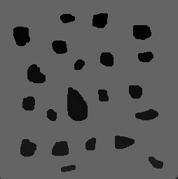

# Eduardo Soares de Araujo Aquino

## Desenvolvimento dos exercícios para nota avaliativa do componente curricular de Processamento Digital de Imagens, utilizando a biblioteca OpenCV para implementação dos exercícios. Foi utilizado o Visual Studio, junto ao binários do OpenCV para copilação do código e implementação. A linguagem utilizada foi C++.

## 2. Manipulando pixels em uma imagem

### 2.1 Utilizando o programa [exemplos/pixels.cpp](https://agostinhobritojr.github.io/tutorial/pdi/exemplos/pixels.cpp) como referência, implemente um programa `regions.cpp`. Esse programa deverá solicitar ao usuário as coordenadas de dois pontos P1�1 e P2�2 localizados dentro dos limites do tamanho da imagem e exibir que lhe for fornecida. Entretanto, a região definida pelo retângulo de vértices opostos definidos pelos pontos P1�1 e P2�2 será exibida com o negativo da imagem na região correspondente. O efeito é ilustrado na [Figura 4](https://agostinhobritojr.github.io/tutorial/pdi/#fig_regions).

Nosso primeiro desafio como descrito acima é utilizar o código base do exemplo descrito para implementar um programa que recebe como entrada 2 pontos de coordenadas e aplicar seu ponto de forma negativa. Para isso, alterei o código fonte para satisfazer o exercírcio. Abaixo o código fonte.

```cpp
int main(int, char**) {
    
    cv::Mat image;
    cv::Vec3b val;

    // arquivo local da image
    auto filename = "C:\\Users\\Eduardo Soares\\Desktop\\Projetos Pessoais\\OpenCV\\OpenCV\\biel.png";

    image = cv::imread(filename);
    if (!image.data)
        std::cout << "nao abriu biel.png" << std::endl;

    cv::namedWindow("janela", cv::WINDOW_AUTOSIZE);

    int x1, y1, x2, y2;

    // leitura do primeiro ponto
    std::cout << "Digite as coordenadas do ponto P1 (x1 y1): ";
    std::cin >> x1 >> y1;

    // leitura do segundo ponto
    std::cout << "Digite as coordenadas do ponto P2 (x2 y2): ";
    std::cin >> x2 >> y2;

    // capture os valores máximos e mínimos das coordenadas
    int minX = std::min(x1, x2);
    int maxX = std::max(x1, x2);
    int minY = std::min(y1, y2);
    int maxY = std::max(y1, y2);

    // percorra os pixeis da imagem de acordo com os valores do pontos fornecidos
    for (int i = minY; i <= maxY; i++) {
        for (int j = minX; j <= maxX; j++) {
            image.at<cv::Vec3b>(i, j)[0] = 255 - image.at<cv::Vec3b>(i, j)[0]; // troque para negativo do canal azul
            image.at<cv::Vec3b>(i, j)[1] = 255 - image.at<cv::Vec3b>(i, j)[1]; // troque para negativo do canal verde
            image.at<cv::Vec3b>(i, j)[2] = 255 - image.at<cv::Vec3b>(i, j)[2]; // troque para negativo do canal vermelho
        }
    }

    cv::imshow("janela", image);
    cv::waitKey();
    return 0;
  }
```

Primeiramente, criei 4 variáveis de entradas sendo os pontos P1 e P2 que demarcarão minha imagem. Em seguida, faço a leitura desses pontos.

Calculando os valores máximos e mínimos das coordenadas, podemos aplicar isso ao loop for para percorrer a partir dos pontos fornecidos. Em seguida, realizando a operação abaixo, podemos aplicar a mudança inversa de cor para o píxel relacionados.

```cpp
image.at<cv::Vec3b>(i, j)[0] = 255 - image.at<cv::Vec3b>(i, j)[0]// troque para negativo do canal azul

image.at<cv::Vec3b>(i, j)[1] = 255 - image.at<cv::Vec3b>(i, j)[1]// troque para negativo do canal verde

image.at<cv::Vec3b>(i, j)[2] = 255 - image.at<cv::Vec3b>(i, j)[2]// troque para negativo do canal vermelho
```

Calculando os valores máximos e mínimos das coordenadas, podemos aplicar isso ao loop for para percorrer a partir dos pontos fornecidos. Em seguida, realizando a operação abaixo, podemos aplicar a mudança inversa de cor para o píxel relacionados.





### 2.1 Utilizando o programa exemplos/pixels.cpp como referência, implemente um programa trocaregioes.cpp. Seu programa deverá trocar os quadrantes em diagonal na imagem. Explore o uso da classe Mat e seus construtores para criar as regiões que serão trocadas. O efeito é ilustrado na Figura 5.

Nosso primeiro desafio como descrito acima é utilizar o código base do exemplo descrito para implementar um programa que recebe a image de biel e inverter os quadrantes da imagem. Portando, meu código alterado do código fonte ficou da seguinte maneira.

```cpp
#include <iostream>

  #include <opencv2/opencv.hpp>

  int main(int argc, char** argv) {
      
      cv::Mat image;
      auto filename = "C:\\Users\\Eduardo Soares\\Desktop\\Projetos Pessoais\\OpenCV\\OpenCV\\biel.png";

      image = cv::imread(filename);
      if (!image.data) {
          std::cout << "Não foi possível abrir a imagem." << std::endl;
          return -1;
      }

      cv::namedWindow("Original", cv::WINDOW_AUTOSIZE);
      cv::imshow("Original", image);

      int rows = image.rows; //capturar quantidade de pixeis nas linhas
      int cols = image.cols; // capturar quantidade de pixeis nas colunas

      // Recortar imagem no primeiro quadrante
      cv::Mat topLeft = image(cv::Range(0, rows / 2), cv::Range(0, cols / 2));
      // Criar imagem no segundo quadrante
      cv::Mat topRight = image(cv::Range(0, rows / 2), cv::Range(cols / 2, cols));
      // Criar imagem no Terceiro quadrante
      cv::Mat bottomLeft = image(cv::Range(rows / 2, rows), cv::Range(0, cols / 2));
      // Criar imagem no Quarto quadrante
      cv::Mat bottomRight = image(cv::Range(rows / 2, rows), cv::Range(cols / 2, cols));

      // Troca os quadrantes em diagonal
      cv::Mat temp = topLeft.clone();
      topLeft = bottomRight.clone();
      bottomRight = temp.clone();

      temp = topRight.clone();
      topRight = bottomLeft.clone();
      bottomLeft = temp.clone();

      // Reconstrói a imagem com os quadrantes trocados
      cv::Mat swappedImage; // Imagem vazia
      cv::hconcat(topLeft, topRight, swappedImage);
      cv::hconcat(bottomLeft, bottomRight, temp);
      cv::vconcat(swappedImage, temp, swappedImage);

      cv::namedWindow("Quadrantes Trocados", cv::WINDOW_AUTOSIZE);
      cv::imshow("Quadrantes Trocados", swappedImage);

      cv::waitKey(0);
      return 0;
  }
```

Primeiramente, capturei a quantidade de pixeis das linhas e colunas da imagem de biel.

Em seguida, utilizando o método Range, criei 4 instâncias novas de imagens partindo por referência as colunas e linhas da imagem original, guardando assim cada instância de quadrante respectiva da imagem original. Agora, realizando uma troca de quadrante de diagonal simplesmente igualando a image de um quadrante ao outro.

```
// Recortar imagem no primeiro quadrante
  cv::Mat topLeft = image(cv::Range(0, rows / 2), cv::Range(0, cols / 2));
  // Criar imagem no segundo quadrante
  cv::Mat topRight = image(cv::Range(0, rows / 2), cv::Range(cols / 2, cols));
  // Criar imagem no Terceiro quadrante
  cv::Mat bottomLeft = image(cv::Range(rows / 2, rows), cv::Range(0, cols / 2));
  // Criar imagem no Quarto quadrante
  cv::Mat bottomRight = image(cv::Range(rows / 2, rows), cv::Range(cols / 2, cols));

  // Troca os quadrantes em diagonal
  cv::Mat temp = topLeft.clone();
  topLeft = bottomRight.clone();
  bottomRight = temp.clone();

  temp = topRight.clone();
  topRight = bottomLeft.clone();
  bottomLeft = temp.clone();
```

Por final, criei uma nova instância de imagem que irá receber os quadrantes trocados superiores, utilizando o método hconcat, para realizar um merge dos dois quadrantes superiores para dentro de swappedImage. Em seguida, da mesma maneira para os quadrantes de baixo.




### 

## 3. Serialização de dados em ponto flutuante via FileStorage

## 3.1 Utilizando o programa filestorage.cpp como base, crie um programa que gere uma imagem de dimensões 256x256 pixels contendo uma senóide de 4 períodos com amplitude de 127 desenhada na horizontal, como aquela apresentada na Figura 6 . Grave a imagem no formato PNG e no formato YML. Compare os arquivos gerados, extraindo uma linha de cada imagem gravada e comparando a diferença entre elas. Trace um gráfico da diferença calculada ao longo da linha correspondente extraída nas imagens. O que você observa?

Primeio passo foi alterar a frequência exigida na questão, alterando a variável global. Em seguida, como explica o algoritmo do professor, foi salvo a imagem no formato yml.

```cpp
  #include <iostream>
  #include <opencv2/opencv.hpp>
  #include <sstream>
  #include <string>
  #include <math.h>

  # define M_PI           3.14159265358979323846

  int SIDE = 256;
  int PERIODOS = 4;

  int main(int argc, char** argv) {
    
      std::stringstream ss_img, ss_yml;
      cv::Mat image;
      cv::Mat savedImage;

      ss_yml << "senoide-" << SIDE << ".yml";
      image = cv::Mat::zeros(SIDE, SIDE, CV_32FC1);

      cv::FileStorage fs(ss_yml.str(), cv::FileStorage::WRITE);

      for (int i = 0; i < SIDE; i++) {
          for (int j = 0; j < SIDE; j++) {
              image.at<float>(i, j) = 127 * sin(2 * M_PI * PERIODOS * j / SIDE) + 128;
          }
      }

      fs << "mat" << image;
      fs.release();

      cv::normalize(image, image, 0, 255, cv::NORM_MINMAX);
      image.convertTo(image, CV_8U);
      ss_img << "senoide-" << SIDE << ".png";
      cv::imwrite(ss_img.str(), image);

      fs.open(ss_yml.str(), cv::FileStorage::READ);
      fs["mat"] >> savedImage;

      cv::Mat diffImage;

      diffImage.convertTo(diffImage, CV_8U);
      savedImage.convertTo(savedImage, CV_8U);

      cv::absdiff(image, savedImage, diffImage);

      int lineOfCenterImage = SIDE / 2;

      std::vector<int> diffValues;
      for (int j = 0; j < SIDE; j++) {
          diffValues.push_back(static_cast<int>(diffImage.at<uchar>(lineOfCenterImage, j)));
      }

      // Exibir a diferença ao longo da linha
      cv::Mat diffPlot(SIDE, SIDE, CV_8U, cv::Scalar(255));
      for (int j = 0; j < SIDE; j++) {
          diffPlot.at<uchar>(lineOfCenterImage, j) = diffValues[j];
      }

      cv::imshow("Diferença na linha", diffPlot);
      cv::waitKey();

      return 0;
  }
```

Criando uma matriz da imagem em branco, calculei a direrença usando o método absdiff do OpenCV. A diferença as duas imagens me resultou em uma imagem em branco, então capturando a dimensão da imagem e dividido por 2, utilizei o push para inserir no meio da imagem o valor do pixel central.

Isso me resultou em uma imagem em branco, com uma linha com tonalidade cinza no meio da imagem.





## 5. Preenchimento de regiões

### 5.1 Observando-se o programa labeling.cpp como exemplo, é possível verificar que caso existam mais de 255 objetos na cena, o processo de rotulação poderá ficar comprometido. Identifique a situação em que isso ocorre e proponha uma solução para este problema.

Para resolver o problema de casos que a imagem tenha mais que 255 objetos a serem rotulados, podemos usar uma estrategia de fazer o rotulo ser decimal, ou rotula usando a operação mod de 255.

### 5.2 Aprimore o algoritmo de contagem apresentado para identificar regiões com ou sem buracos internos que existam na cena. Assuma que objetos com mais de um buraco podem existir. Inclua suporte no seu algoritmo para não contar bolhas que tocam as bordas da imagem. Não se pode presumir, a priori, que elas tenham buracos ou não.

Primeiramente utilizei o código fonte base para implementação. Criei um for para percorrer as bordas da imagem de entrada, caso o valor do píxel seja 255, vou aplicar o algoritmo do floodFill(image, p, 0), nesse caso para bordar superior e inferior. Para as bordas laterais aplica-se com a mudança dos pixeis da borda, floodFill(image, p, 0); Sendo o ponto daquela borda e o valor novo de intensidade 0. Isso garante a imagem abaixo.

```cpp
#include <iostream>
  #include <opencv2/opencv.hpp>
  
  using namespace cv;

  int main(int argc, char**) {
    
      cv::Mat image, realce;

      int width, height;
      int nobjects = 0;
      int buracos = 0;

      auto filename = "C:\\Users\\Eduardo Soares\\Desktop\\Projetos Pessoais\\OpenCV\\OpenCV\\bolhas.png";

      cv::Point p;
      image = cv::imread(filename, cv::IMREAD_GRAYSCALE);

      if (!image.data) {
          std::cout << "imagem nao carregou corretamente\n";
          return (-1);
      }

      width = image.cols;
      height = image.rows;
      std::cout << width << "x" << height << std::endl;

      p.x = 0;
      p.y = 0;

      //excluindo objetos que tocam nas bordas superiores e inferiores
      for (int i = 0; i < height; i++)
      {
          if (image.at<uchar>(0, i) == 255)
          {
              p.x = i;
              p.y = 0;
              floodFill(image, p, 0);
          }
          if (image.at<uchar>(width - 1, i) == 255)
          {
              p.x = i;
              p.y = width - 1;
              floodFill(image, p, 0);
          }
      }

      //excluindo objetos que tocam nas bordas laterais
      for (int i = 0; i < width; i++)
      {
          if (image.at<uchar>(i, 0) == 255)
          {
              p.x = 0;
              p.y = i;
              floodFill(image, p, 0);
          }
          if (image.at<uchar>(i, height - 1) == 255)
          {
              p.x = height - 1;
              p.y = i;
              floodFill(image, p, 0);
          }
      }

      imshow("Imagem com bordas removidas", image);

      //mudando a cor do backgrpund para pode identificar os buraco
      p.x = 0;
      p.y = 0;

      cv::floodFill(image, p, 100);
      cv::imshow("Mudança de background da imagem", image);

      for (int i = 0; i < height; i++) {
          for (int j = 0; j < width; j++) {
              if (image.at<uchar>(i, j) == 255) {
                  // achou um objeto
                  nobjects++;
                  // para o floodfill as coordenadas
                  // x e y são trocadas.
                  p.x = j;
                  p.y = i;
                  // preenche o objeto com o contador
                  cv::floodFill(image, p, nobjects);
              }
              if (image.at<uchar>(i, j) == 0){
                  // achou um buraco
                  buracos++;
                  p.x = j;
                  p.y = i;
                  // preenche o buraco com o fundo da imagem originial
                  floodFill(image, p, 255);
              }
          }
      }
      std::cout << "a figura tem " << nobjects << " bolhas\n";
      std::cout << "numero de buracos: " << buracos << std::endl;

      cv::imshow("Imagem preenchida", image);
      cv::imwrite("labeling.png", image);
      cv::waitKey();
      return 0;
  }
```



Apliquei uma mudança de intensidade no background para identificar os buracos presentes na imagem, ai o terceiro for executa dois trabalhos paralelos, um if para aplicar a quantidade de objetos identificados na imagem e outro para preencher o burado caso seja encontrado um objeto com tonalidade baixa. Isso resultou na imagem abaixo:


